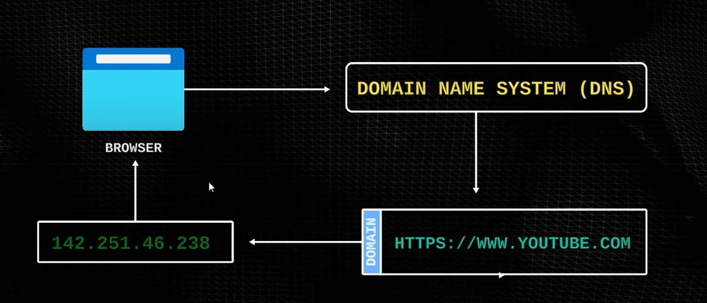

# DNS
- O Dns serve para a tradução de um domínio para um endereço ip, para que você consiga acessar sites, por exemplo o youtube.

navegador -> youtube.com -> Dns -> 173.194.33.174 -> navegador -> requisição HTTP -> resposta -> navegador    