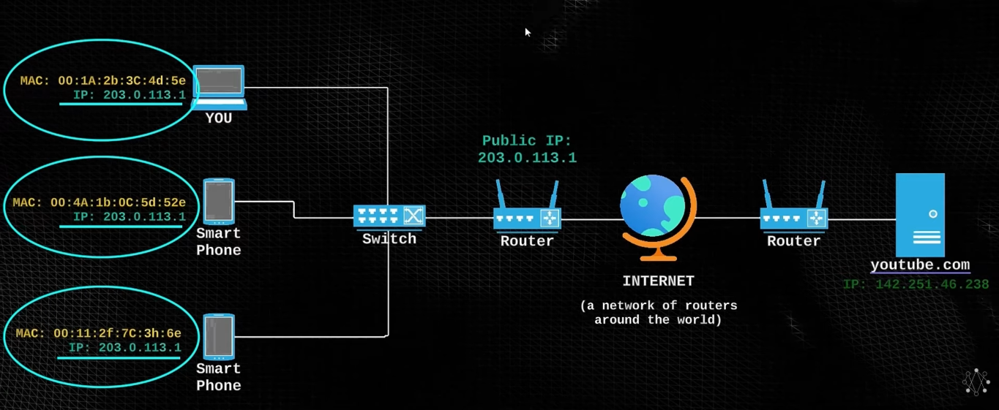
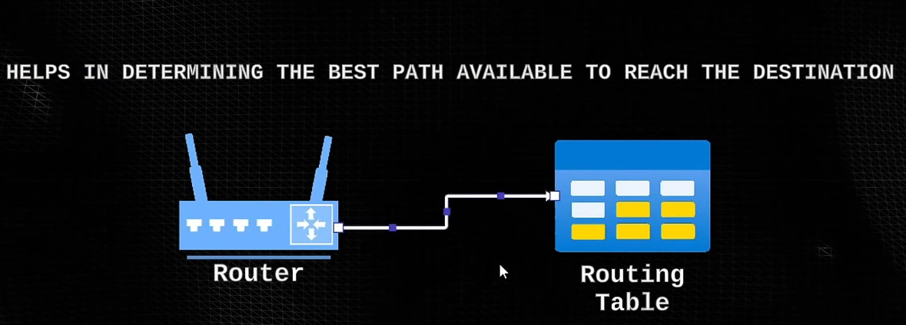
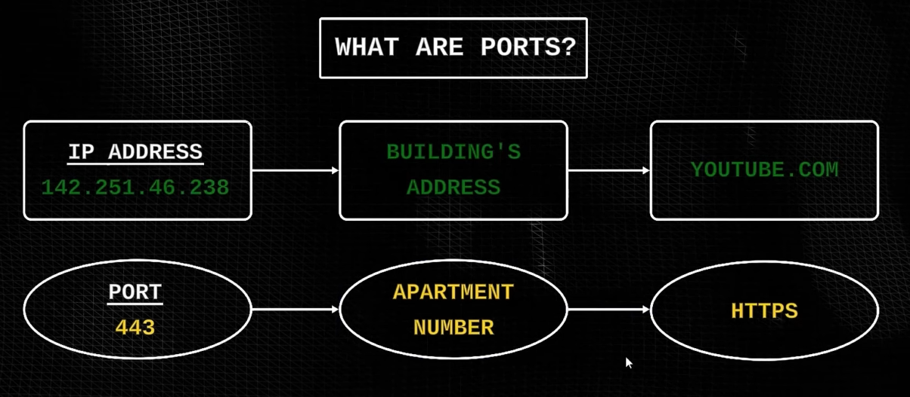

# Endereço ip

- O endereco ip em si serve apenas para os dispositivos dentro da sua rede, pois apenas quem esta dentro da sua rede consegue ver seu ip real.

# Tecnologia NAT
- Para que você consiga usar a internet ou enviar um pacote para outro computador que não está dentro da sua rede, basicamente o seu roteador vai atribuir um ip público para o seu computador, então todos os dispotivos da sua rede que usaram a internet, também terão esse ip público

# Portas
 Pense nas portas como se fossem os numeros dos apartamentos de um prédio gigante com 65.536 apartamentos diferentes. Dentro desse apartamentos existem funcionalidades diferentes e podem estar abertas, fechadas, ou funcionando. O endereço do prédio é o ip, por isso que com apenas o ip não podemos determinar muita coisa.

## Exemplo
 Quero abrir o site do youtube, oque realmente acontece?

1. O navegador pega o dominío que você digitou nele e joga para o dns.
2. O dns traduz o domínio para um ip.
3. Com esse ip, o computador tenta localizar ele dentro da sua rede, por meio do switch. Como ele não vai achar esse ip dentro da sua rede, ele vai mandar a request para o seu roteador, porque ele vai estar em algum lugar da internet.
4. Quando a request chega dentro do seu roteador ele ira usar o protocolo Nat para traduzir seu ip para o público, para que você acesse a internet.

5. O roteador depois de ter convertido o seu ip vai tracar a melhor rota para o destinatário por meio de uma tabela de roteamento.

6. Assim que isso for concluído, o roteador faz a requisição para a porta específica HTTP **80** do youtube 

7. O youtube manda a respose com os dados que você pediu por meio do http